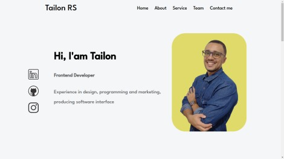

# Índice
- [Proposta](#id01)
- [Screenshots](#id02)
- [Links](#id03)
- [Feito_com](#id04)
- [Autor](#id05)

# 🚀 Proposta 

Portfólio de apresentação com Características do autor

A Abordagem é refatorar o portfólio antes apresentado porém publica-lo com responsividade e melhor Readme.

 

Data do início: 25/04/2022

# :camera_flash: Screenshots 

 

## :iphone: Mobile design

  </img>

## :desktop_computer: Desktop design

  </img>

# :heavy_check_mark: Links 

Portfólio: https://ramostailon.github.io/github-pages/

# 🛠 Feito com 

 

- 
- 
- 

# :sunglasses: Autor 

- GitHub: https://www.github.com/RamosTailon

- Email: [tailonramos11@gmail.com](mailto:tailonramos11@gmail.com)

- Linkedin: https://www.linkedin.com/in/tailon-ramos-25271022a/